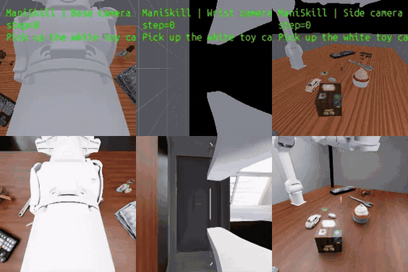
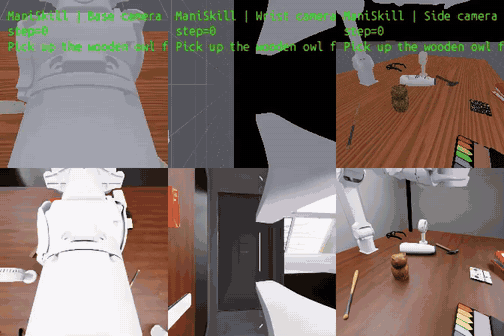
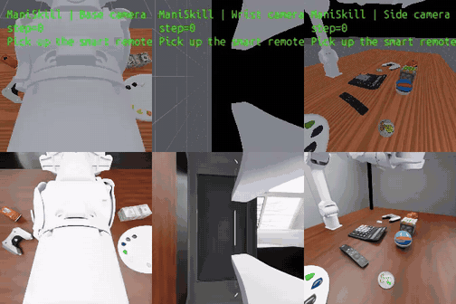

# Single-Arm `general_pickup_single`

Single-arm variant of `general_pickup` for training and evaluating **single-arm
pickup** policies, before dual-arm pickup is on the roadmap. Same task logic
and reward as the base task (lift the target object by 10 cm), same object
pool and clutter, but driven by **one centered Piper arm**.

## Files

| File | Purpose |
| :-- | :-- |
| `task/RoboDojo/tasks/general_pickup_single.py` | task class; reuses `GeneralPickupCommon` (reward: `is_lift(target, 0.1)`) |
| `task/RoboDojo/config/general_pickup_single.yml` | task config: target workspace `xlim ±0.25`, clutter `xlim ±0.3` |
| `env_cfg/robot/single_piper.yml` | single Piper arm, base `[0, -0.45, 0.765]`, facing the table |
| `env/robot_manager/robot_class/piper.py` + `robot_config/piper.py` | Piper robot class + IsaacLab articulation cfg (registered in `robot_manager.py`) |
| `env_cfg/robot/_robot_info.json` | `single_piper` action dims (`arm_dim: [6]`, `ee_dim: [1]`) |
| `env_cfg/piper_single.yml` | eval env cfg (`--env-cfg piper_single`) |
| `env_cfg/sim/sim_config_piper_policy.yml` | exact 20 Hz policy cadence (10 × 0.005 s physics steps) |
| `env_cfg/camera/camera_config_piper_policy.yml` | training-matched `cam_head` + `cam_wrist` + `cam_side` at 224×224 |
| `env_cfg/scene/single_arm.yml` | default scene with the head-camera tripod relocated |
| `scripts/internal/privileged_pick.py` | ground-truth-guided pick controller (QA) |
| `scripts/internal/scripted_single_arm_pickup.py` | policy-free validation runner |
| `validate_single_arm.sh` | policy-eval validation entry point |

## Design decisions

- **Arm placement**: one Piper centered at `[0, -0.45, 0.765]`. Worst-case radial
  reach equals what each dual arm covers for its own half of the workspace.
  (A `single_x5` config also exists as an alternate embodiment: task and
  env cfgs are robot-agnostic; pick via `--env-cfg` / `robot:` key.)
- **Workspace `±0.25`** (base task is `±0.4` across two arms): the outer band
  beyond ~`±0.3` is where the centered arm's wrist cannot form a true vertical
  top-down grasp at full extension. Reachability was validated 20/20 over the
  full `±0.4` dual-arm layouts with an orientation scan; `±0.25` keeps a
  comfortable posture margin.
- **Tripod relocation** (`scene/single_arm.yml`): the default scene places the
  head-camera tripod pole at `[0, -0.47]` — the slot *between* the two dual
  arms. A centered single arm spawns **inside** that pole; physics wrecks
  every joint command from the first step. The single-arm scene moves the
  stand to `[-0.55, -0.47]`. When replaying pre-generated **dual-arm**
  `Eval_Layout` jsons (which bake the old stand position in), the scripted
  runner patches the stand position in memory.
- **Action/observation keys**: single-arm robots use unprefixed keys
  (`arm_joint_state`, `ee_joint_state`, `ee_pose`, ...) and must not emit
  `left_`/`right_` prefixed keys — see `eval_env.validate_action_dict`.

## Policy-free validation (privileged scripted grasp)

No policy server needed; drives the robot only through normal joint actions
while reading ground-truth target pose/bbox:

```bash
python scripts/internal/scripted_single_arm_pickup.py \
    --headless --enable_cameras --episodes 10
```

`Assets/Robots/piper/` is **not** in the HF asset repo — bootstrap it from
[piper_ros (noetic branch)](https://github.com/agilexrobotics/piper_ros/tree/noetic/src/piper_description)
(`src/piper_description`) with `scripts/internal/build_piper_assets.py`:

```bash
# laptop: copy urdf+meshes, generate robot_config.yml / curobo.yml
python scripts/internal/build_piper_assets.py \
    --piper-src /path/to/piper_ros-noetic/src/piper_description

# server (robodojo env): also convert the URDF to piper.usd
python scripts/internal/build_piper_assets.py \
    --piper-src /path/to/piper_description \
    --assets-root /path/to/Assets \
    --convert --headless
```

The zero-shot policy reproduction pins `piper_ros/noetic` to
`ac41fcbcdda598f01b51cf6175ed9a24d0dacadc`; do not build the asset from a
moving branch head.

The bootstrap:

- copies `piper_description.urdf` + STL meshes, rewriting `package://` mesh
  paths to relative ones;
- parses the URDF and generates `robot_config.yml` (joint1-6 revolute arm;
  joint7/8 prismatic mirrored fingers with mimic −1.0, range [0, 0.035];
  `gripper_bias` 0.18 = link6→TCP, an estimate — tune from first-run videos)
  including a simulation-only `cam_wrist` mounted on the imported
  `root_joint/gripper_base` USD prim (the URDF importer adds `root_joint`),
  and `curobo.yml` (x5-equivalent structure: full 8-joint cspace with
  explicit weights — omitting them crashes curobo's solver core with an
  object-dtype `np.array(None)`; collision spheres omitted since the
  scripted validation is IK-only);
- converts the URDF to `piper.usd` via Isaac Sim's URDF importer
  (`merge_fixed_joints=False` to keep the `joint1`-`joint8` names the repo
  side assumes; importer attribute names are probed with `hasattr` because
  they differ across Isaac versions).

**Note on the tool axis**: the piper's gripper extends along **link6 +Z**,
unlike the x5's **+X**. Grasp orientations carry an `approach_axis_index`
(2 for piper, 0 for x5 — auto-detected by the runner from the robot name);
`single_piper.yml` uses the `piper_top_down` direction. Applying an x5
orientation to a piper points the gripper horizontally forward instead of
down — the exact symptom of the first piper bring-up run.

- Replays dual-arm `Eval_Layout` jsons (object placements are arm-independent).
- **Workspace filter**: only layouts whose target lies within `|x| ≤ 0.25`,
  `y ∈ [-0.25, 0]` are graded; out-of-workspace layouts are excluded and
  counted separately (never mixed into the pass rate). Override with
  `--workspace-x` / `--workspace-y`.
- Per-episode outputs: verdict line (pass/fail + lift/hold/drop numbers), a QA
  json report (`eval_result/scripted_single_arm/privileged_pick_layout_*.json`)
  with per-stage tracking errors, and mp4 videos per camera.
- Useful flags: `--no-video`, `--seed`, `--episodes`, `--sim-device cpu`
  (default), `--layout-dir` / `--layout-pattern`.

### Known limitations

- **Camera appearance is sim-to-sim, not pixel-identical**: camera intrinsics,
  optical pose and input resolution match LiftAnything training, while renderer,
  lighting and RoboDojo object assets remain intentionally unchanged.
- **Ring/hollow objects** (e.g. `tiara`, `donut`, `frame`): the scripted
  controller grasps the bbox **center**, which is empty space for such shapes.
  These are reported as fails — a limitation of the scripted checker, not of
  the task.
- **cuda sim device**: the scene manager reuses rigid prims across episodes
  instead of respawning them, so replayed layouts that swap object sets break.
  Run with the default cpu device (production behavior).
- **Video** bypasses `TiledCaptureManager` (a warp kernel hang observed in
  some containers) and uses cpu replicator annotators instead.

## Cross-simulator direct-replay examples

The examples below replay the same successful ManiSkill joint-action trajectory
in RoboDojo without RoboDojo-specific training. The top row is ManiSkill and the
bottom row is RoboDojo; columns show the base/head, wrist, and side cameras.
These are direct-action simulator replays used to validate task and dynamics
alignment, not PI-0.5 policy closed-loop evaluations in RoboDojo.

<p align="center">
  <strong>White toy car</strong><br>
  
</p>

<p align="center">
  <strong>Wooden owl</strong><br>
  
</p>

<p align="center">
  <strong>Smart remote</strong><br>
  
</p>

## Policy evaluation (once a policy exists)

```bash
# Native PI-0.5 PIPER zero-shot policy: one-command worker launch. This
# includes GPU/asset/LFS preflight, EULA setup, fixed layouts 0-9, result and
# video validation, and optional HDFS archiving.
bash scripts/run_pi05_piper_zero_shot.sh \
    --ckpt /path/to/checkpoint \
    --policy-env /path/to/openpi-uv \
    --eval-env /path/to/robodojo-uv \
    --assets-root /path/to/hydrated/Assets \
    --hdfs-output hdfs://your/result/directory

# Generic policy entry point:
bash scripts/robodojo.sh eval \
    --task general_pickup_single \
    --env-cfg piper_single \
    --policy-dir XPolicyLab/policy/<POLICY> \
    --ckpt <CKPT> --policy-env <ENV>

# or the full staged check:
bash validate_single_arm.sh XPolicyLab/policy/<POLICY> <CKPT> <ENV>
```

The policy must emit **unprefixed single-arm action keys**; camera keys use
`cam_wrist` (not `cam_left_wrist`/`cam_right_wrist`).

## Framework fixes included (found during single-arm bring-up)

All three were latent bugs that only surface with a single-arm robot config
(dual-arm eval never triggers them). Each was found by isolating one layer at
a time.

- `env/planner_manager/curobo_planner.py`: resolve `$RoboDojo_ASSETS`
  placeholders in curobo kinematics `urdf_path`/`asset_root_path` — without
  this the URDF loader falls back to curobo's content dir and fails.
  Symptom: `ValueError: .../content/assets/$RoboDojo_ASSETS/... is not a file`
  at planner construction.
- `env/robot_manager/robot_manager.py`: `restore_name` mapped the bare
  single-arm gripper name `ee` to `arm`, crashing `set_robot_init_state`.
  Symptom: `No robot found with gripper name: arm` on the first reset.
- `env/scene_manager/layout_manager.py`: `get_instance_pose` returned cuda
  tensors on cuda-device envs; callers concatenate them with numpy and crash.
  Found by running the same env on `--sim-device cpu` (production default,
  where it always worked) vs cuda.

## Debugging notes (issues hit during bring-up, for future reference)

- **Camera tripod blocked the centered arm.** The default scene places the
  head-camera tripod pole at `[0, -0.47]` — the empty slot *between* the two
  dual arms. A centered single arm spawns **inside** the pole, so physics
  wrenched the joints away from every command. Found with an FK probe:
  command "hold joint1 at its current value" and watch it drift 1.16 rad —
  proof of an external collision, not a control or IK problem. The stand is
  also **baked into every replayed layout json**, so fixing the scene yml
  alone did nothing; the scripted runner patches the position in memory.
- **cuda sim device breaks layout replay.** On cuda the scene manager
  relocates rigid prims offscreen and reuses them across episodes instead of
  respawning, so a layout change that swaps the object set leaves layout
  records pointing at nonexistent scene objects. Run the cpu device
  (production behavior).
- **warp kernel hang in-container.** `TiledCaptureManager`'s tiled reshape
  (`wp.launch`) spun forever on first use inside Isaac in this container,
  while standalone warp worked fine. The runner records video through
  device="cpu" replicator annotators instead — no warp anywhere.
- **Reward registration order matters.** Calling any action (even a
  diagnostic probe) before `run_reward()` registers the task check makes
  `get_reward` return 1.0 for an empty check_list — the episode is marked
  "successfully ended" before the grasp starts.
- **Out-of-workspace targets grasp badly.** Beyond ~|x|=0.3 the arm is near
  full extension and the wrist cannot form a true vertical top-down grasp
  (orientation error pinned at the 0.2 rad tolerance). This is why the task
  workspace is ±0.25 and why the scripted runner filters layouts by target
  position instead of grading borrowed dual-arm layouts fairly.
- **Ring/hollow objects defeat the scripted checker.** The controller grasps
  the bbox center, which is empty space for `tiara`/`donut`/`frame`-style
  shapes; the gripper closes on nothing. Known limitation of the checker,
  not the task.
